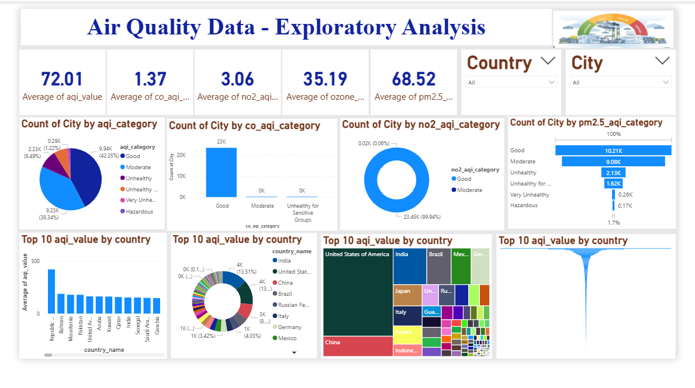

# 🌍 Air Quality Data Visualization  
### Power BI Exploratory Dashboard Project

This repository contains a complete **Power BI Dashboard** for understanding and analyzing global **Air Quality Index (AQI)** levels.  
The dashboard includes multiple visuals that highlight pollution categories, AQI trends, and country-wise comparisons.

---

## 📸 Dashboard Preview



---

## 📁 Project Structure

📦 air-quality-data-visualization
┣ 📂 data
┃ ┗ air_pollution_data.csv
┣ 📂 pbix
┃ ┗ air_quality_dashboard.pbix
┣ 📂 Image
┃ ┗ D1.png
┗ 📄 README.md


---

## 📊 Dashboard Highlights

### ✔ KPI Metrics  
- Average AQI  
- Average CO AQI  
- Average NO₂ AQI  
- Average Ozone AQI  
- Average PM2.5 AQI  

### ✔ Visualizations  
- AQI category distribution (Good, Moderate, Unhealthy, etc.)  
- CO, NO₂, PM2.5 category distribution  
- Top 10 AQI countries (bar, donut, tree map, funnel charts)  
- Country & City slicers for interactive filtering  

---

## 🧹 Data Preparation (Power Query)

Steps performed:
- Removed duplicates  
- Cleaned null and missing values  
- Standardized column names  
- Converted AQI fields to numeric types  
- Added categorized AQI labels  
- Extracted and formatted country & city fields  

---

## 🚀 How to Use

### 1. Clone this repository
```bash
git clone https://github.com/juned-k786/air-quality-data-visualization

2. Open the Power BI file

Go to:

pbix/air_quality_dashboard.pbix

3. Ensure dataset path matches

The CSV file must be inside:

data/air_pollution_data.csv

🛠 Tools Used
Tool	Purpose
Power BI Desktop	Dashboard creation
Power Query (M Language)	Data cleaning
CSV Dataset	Source data
📄 License

This project is licensed under the MIT License.

🤝 Contributing

Contributions are welcome!
Feel free to open issues or submit pull requests.

---

If you want, I can also generate:
✅ Repo badges  
✅ GitHub tags  
✅ Attractive banner header  
Just tell me!

